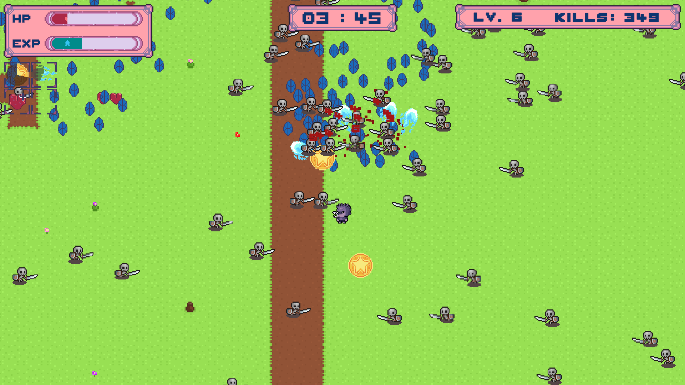
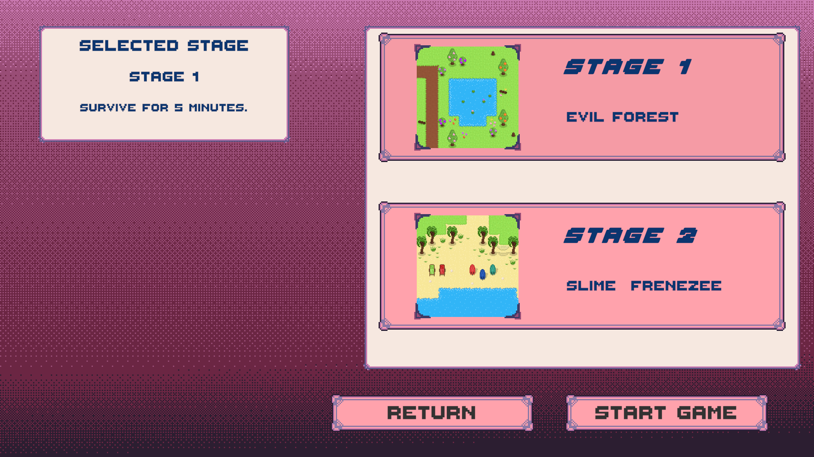
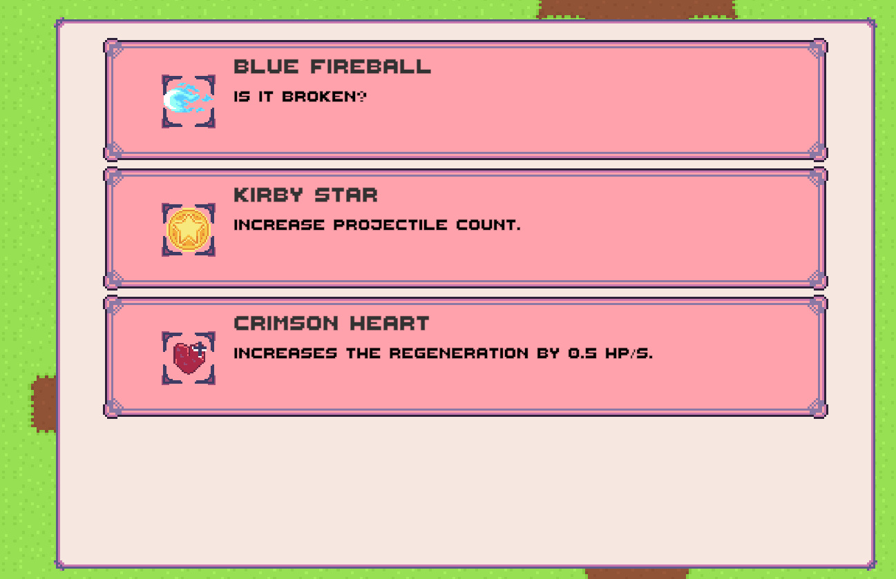
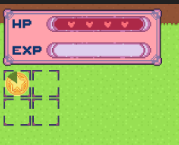
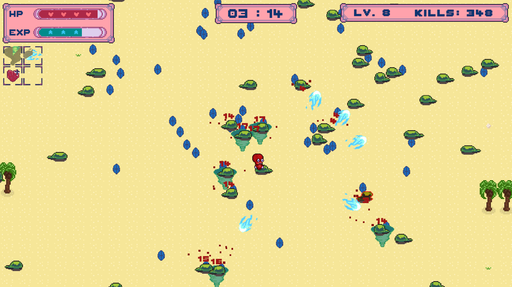

# PR : Cute Survivors
Enllaços:

[Itch.io - CuteSurvivors by Burbuu:](https://burbuu.itch.io/cute-survivors)

[Gameplay complet del primer nivell (6 mins):](https://youtu.be/1DezpT9gl8g)

[Gameplay - Versió editada (2min):](https://youtu.be/RHxEfWJAbWA)

## Introducció: 
En aquesta pràctica he decidit desenvolupar un _**clon**_ del Joc **Vampire Survivors**. 
L'objectiu a aquest joc és _**sobreviure durant una determinada quantitat de temps**_ a onades interminables d'enemics. 

El que defineix aquest joc (i el gènere que li precedeix) és que **li jugadori no té control directe sobre l'atac**: aquesta acció ocorre 
de manera automàtica. Així doncs, li jugadori ha de centrar-se a **recollir experiència** per pujar de nivell i millorar les seues
estadistiques, armes i habilitats per sobreviure el major temps possible.

---
## Plataformes:
- Windows 
- Linux
- Browser

## Controls:

**Teclat**:
- **WASD** o **Arrows** per deslpaçar-se.

**Controller**:
- **Left Joystick** o **D-Pad** per desplaçar-se horitzontalment.

 ----

## Mecàniques de joc:

 L'objectiu del joc és sobrevivre durant una determinada quantitat de temps a onades interminables d'enemics.

### Onades d'enemics:

Cada minut de joc, la dificultat augmenta progressivament.

El joc genera onades de diferents tipus d'enemics que li jugadori ha d'esquivar i derrotar. 

Aquesta dificultat variable té com a objectiu **presionar li jugadori en recollir experiència** per millorar el 
personatge i adaptar-se per poder continuar jugant.

### Sistema de nivells (player):

Li jugadori ha de recollir experiència per pujar de nivell. 

Cada vegada que puja de nivell, el joc es pausa i ofereix diverses **opcions de armes i accessoris** per adquirir-les o millorar-les. En aquest cas he 
decidit que cada nivell ofereix 3 opcions a escollir.

Per poder sobreviure, cal **prendre decicions estratègiques** sobre quines armes i accessoris ha de millorar en cada moment.

### Sistema de estadístiques:

El joc està implementat per oferir diversos personatges amb diferents habilitats i armes inicials diferents. 

Així doncs, el conjunt de classes utilitzades, esta orientat a definir **estructures de dades flexibles**, que permeta modificarles i expandirles fàcilment 
les estadístiques. Aquesta estructura facilita crear personatges nous, accessoris, enemics etc.

### Sistema de desbloqueig de nivells i de items:

En aquest treball s’ha desenvolupat un sistema de guardat de dades, pensat per implementar en el futur un sistema de desbloqueig de nivells, personatges i ítems.

Aquesta part del joc encara no està completament implementada, però l’estructura base ja està preparada.

### Armes i accessoris:
Li jugadori disposa de 3 slots per a armes i 3 slots per a accessoris. Una vegada equipada, no es pot eliminar.
Els accessoris garanteixen habilitats pasives (millores de les estadistiques com dany, velocitat, numero de projectils etc)
i cada arma té un patro unic de projectils.

La característica més destacable de Vampire Survivors és que li jugadori no controla directament l’ús de les armes.
Les armes instancien projectils de manera automàtica, atacant els enemics a intervals regulats.
Li jugadori no pot activar-les manualment, sinó que ha d’optimitzar la seua construcció i esperar que aquestes s’executen.

Els accessoris es milloren a traves de les opcions de millora al pujar de nivell.

He implementat tres tipus d'armes i dos tipus d'accessoris. Però el joc està preparat per inclouren moltes més.

### Nivells:
He implementat dos nivells diferents amb patrons d'onades de enemics diferents. I un menu per seleccionar-lo abans de començar el joc.

---

## Sistemes del joc:

Aquests son els principals sistemes del joc i les classes que els implementen:

### `GameManager`:
Classe encarregada de gestionar les dades persistens del joc. S'encarrega de donar pas a les transicions d'escena (amb fade in/out) i de 
emmagatzemnar les dades necessaries per a iniciar un nivell. Fa de pont entre els altres sistemes del joc i entre 
les escenes.

### `GameplayManager`:
Classe encarregada de gestionar el estat del **gameplay**. Conté una maquina d'estats (**state machine**) per controlar
el flux del joc. Amb els seguents estats: `ActiveState`, `LevelUpState`, `PauseState` i `FinishState`. Cada un d'aquestos estats gestiona el seu flux d'entrada 
i sortida. Amb els mètodes `Enter` i `Exit`.

### Audio:
Per al audio he emprat la classe que vaig desenvolupar a les anteriors pràctiques: `AudioManager`. Fent un canvi per 
poder ajustar el volum dels clips a reproduir. Utilitze **_Scriptable Objects_** per poder definir un diccionari de clips 
i així poder referenciar-los en el codi de forma sencilla.

### Enemics:

Les classes que gestionen els enemics són: `EnemyController`, `EnemyManager` i `EnemySpawner`. A més a més, he definit les estadísiques
dels enemics mitjançant **Scriptable Objects** i classes de dades, seguint un enfocament **data-driven**.
Amb l'objectiu de gestionar desenes o centenars d'enemics simultàniament, he implementat un sistema deObject Pooling i 
on les instàncies dels enemics es creen a l'inici del joc i es reutilitzen al llarg de la seua execució. Les dades dels enemics
(les estadistiques i animacions) estan orientades aquest sistema.
Així mateix els enemics actualitzen el seu pathfinding mitjançant un sistema de _staggered updates_.

La decició dimplementar aquest sistema l'he pres amb l'objectiu d'experimentar amb aquestes tècniques, independentment de si eren
estrictament necessaries per a l'escala del joc.

- `EnemyManager`:
Aquesta classe conté les referències a totes les instàncies d'enemics i les gestiona. Proveeix mètodes
públics de `Spawn` i `Despawn`, que permeten llegir les dades de cada enemic i assignar-lis una posició dins de l’escena.
A més a més, proporciona accés a les posicions dels enemics actius per al sistema d’armes. Finalment, 
també s’encarrega de coordinar les **actualitzacions del pathfinding, processant un nombre fix d’enemics per Update**.

- `SpawnManager`:
S'encarregada de llegir la `StageData` del nivell i _spawnejar_ els enemics segons els patrons que defineixen aquestes
dades. Pasa les dades necessaries per spawnejar els enemics a l'enemic manager.
Havia planejat incloure també els que he anomenat **SpawnEvents** que instanciarien múltiples enemics simultàniament seguint
patrons concrets. Però aquesta funció no està acabada i no l'he inclós al joc (tot i que està present al source code).

- `EnemyController`:

El enemy controller s'encarrega del combat i del moviment d'aquests. Per al pathfinding he creat un mètode públic anomenat
`UpdatePathfinding`. No utilitza Updat per evitar que el pathfinding sigui actualitzat cada frame.
Quan un enemic mor, aquest notifica a l'enemy manager (i a altres sistemes que porten un registre) 
per que es puga eliminar de la llista d'enemics actius.
Els enemics en morir instancien experiència (i a vegades vida extra), que li jugadori ha de recollir. Aqusts objectes són instanciats
pel `EnemyController`.

### Player:
La lògica de li jugadori està estructurada al voltant d'un conjunt de **classes de dades** que **separen l'estat del comportament**, seguint
un enfocament **data-driven**.

Les estadísitiques base estan definides a la classe estàtica `BaseStats`, que actua com a punt de partida. A aquestos valors base
se li afegeixen les bonificacions definides a `StatsData` que conte les bonificacions i `CharacterData` que es el **ScriptableObject** final
que defineix un personatge.

El comportament en execusió es divideix en dues classes:
- `PlayerController`: Classe encarregada del moviment, de la gestió d'animacions, de l'entrada de dades i de la mort del 
personatge. Conté una variable estàtica Instance, que fa de pont amb altres sistemes del joc. Per exemple per als enemics al pathfinding.

- `PlayerStats`: Gestiona les estadístiques del personatge com la vida, el nivell, l'experiència, i totes la resta de dades.
S'encarrega de notificar els altres sistemes d'esdeveniments importants, com un canvi en les estadístiques de combat, o la mort del personatge.

La decisió d'estructurar aquest sistema bé de la ma de facilitar la creació de diferents personatges amb diferents estàdistiques
i de crear un **sistema RPG flexible**.

### Accessoris, armes i inventari:

El sistema d'accessoris i armes està dissenyat seguint també un enfocament **data-driven**. Amb l'objectiu de separar les 
dades del comportament en execució.

Les dades base dels items es defineixen amb ScriptableObjects que deriven de `ItemData`:
- `AccessoryData`
- `WeaponData`

**Inventari**:
El sistema d'inventari està centralizat a la classe Inventory que gestiona les armes i accessoris equipats.

Quan s’afegeix un ítem:
- S’apliquen les bonificacions del nivell 1 directament a `PlayerStats`.
- Es llancen esdeveniments (`OnWeaponAdded`, `OnAccessoryAdded`) per notificar altres sistemes.

**Armes**
Les armes estan representades per la classe `Weapon`, que conte la lògica de combat i del ús de les dades de `WeaponData`.
Aquestes armes no requereixen la entrada de li jugadori, el seu comportament és automatic.

**Accessoris**
Accessoris estan reprentats per la classe `Accessory`, i no té cap comportament actiu, només pasen les dades a `PlayerStats`.

### LevelUp:
En pujar de nivell, aquest sistema llegeix les dades dels items equipats i dóna diverses opcions de millora o adquisició de 
nous items, tenint en compte el nivell nivell màxim d'aquestes i els slots disponibles. Quan el joc es troba en aquest estat, el temps es pausa fins que es trie una opció.
- Classe `Inventary`: Conté l'informació dels itemps equipats i permet llegir-los, així com afegir els nous items.
- Interfície `ILevelUpChoice`: Representa els diferents tipus de opció a triar: millora/aquisició per a arma o accessori.
- Estat `LevelUpState`: Gestiona el flux d'entrada i sortida de l'estat. Crea les opcions de millora/adquisició i les pasa a la UI.
- Classe `LevelUpUI`: Mostra les opcions i processa el resultat de l'elecció.

### SaveSystem:

El joc inclou un sistema de guardat persistent implementat mitjançant les classes `SaveManager`, `SaveData` i `RunData`.
Aquest sistema està pensat com una base per registrar les estadístiques globals, rècords i progrés de li jugadori. 
Tot i que el sistema està implementat i funcional, a la pràctica en el joc no s'utilitza de manera extensiva. 
A la falta de contingut i de temps (i de contingut) no he pogut fer un sistema de un unlocks de personatges, armes etc. Però aquest sistema
funcionaria com a base.

### UI:
Per a la UI he utilitzat recursos propis. Els sprites de els he fet amb aseprite i els he usat amb la tècnica de **9-slice**.

Durant el nivell es mostra la informació rellevant de vida i el estat dels items equipats.

### Menú d'opcions:
El menú d'opcions permet modificar configuracions de l'àudio i vídeo del joc. Utilitzant `PlayersPrefs`.

Opcions d'àudio:
- Volum màster
- Volum de música
- Volum d'effectes sonors

Opcions de vídeo:
- Pantalla completa
- Resolucions

### FX:
He implementat dos efectes visuals respecte al combat:
- Un efecte de partícules que representa la sang de l'enemic.
- Un efecte per mostrar el dany realitzat en l'atac. Per a aquest sistema he utilitzat un World Space Canvas.

A més a més he implementat animacions per al dany, tant als enemics com a li jugadori.

----

## Credits / Assets

- **Tilemaps**  
  [Florest and Beach - Creation Pier](https://creationpier.itch.io/tilemaps-florest-and-beach)

- **Personatges jugables**  
  [72 Cute Pixel Character - BDragon1727](https://bdragon1727.itch.io/72-cute-pixel-character)

- **Projectils i efectes**  
  [Free Effect Bullet Impact & Explosion (32x32) - BDragon1727](https://bdragon1727.itch.io/free-effect-bullet-impact-explosion-32x32)

- **Enemics**  
  [Tiny RPG Character Asset Pack - Zerie](https://zerie.itch.io/tiny-rpg-character-asset-pack)

- **Font**  
  [Free Pixel Font: Thaleah - Unity Asset Store](https://assetstore.unity.com/packages/2d/fonts/free-pixel-font-thaleah-140059)

- **Música**  
[Vampire's Bit (Demo 4) - VampireDev](https://vampiredev.itch.io/vampires-bit-demo)

  [Vampire's Bit Fanart Music - Framed-Mimic-Triptune](https://famed-mimic-triptune.itch.io/vampires-bit-fanart-music)
  
- **SFX**

  [8 Bit sfx - IvoryRed](https://ivoryred.itch.io/8-bit-sfx)

----
## Ús de IA
Durant el procés de programació s'ha emprat GitHub Copilot, per a accelerar l'escriptura de codi, aprofitant els suggeriments quan aquests encaixaben amb la solució desitjada. En aquest cas no s'han usat prompts especifics.

